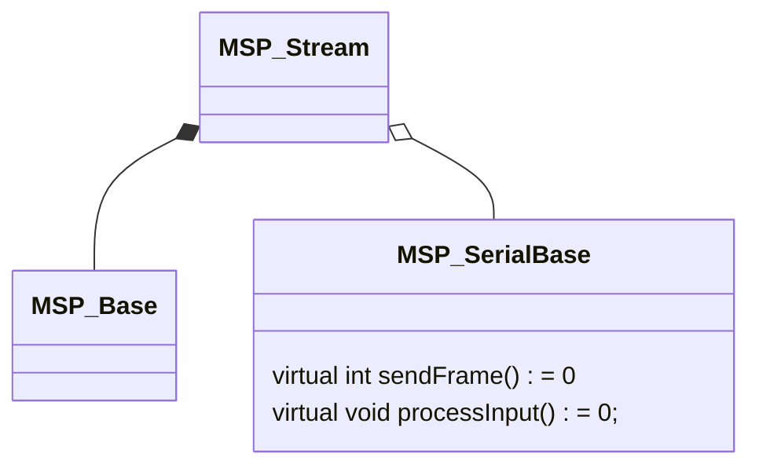

# MultiWii Serial Protocol  

MultiWii Serial Protocol framework, ported from the Betaflight implementation.

## License Information

This library is a port (modification) of the Blackbox implementation
in Betaflight (which itself was a port of the Cleanflight implementation).

Both Betaflight and Cleanflight are licensed under the GNU GPL

The original Betaflight copyright notice is included in License.txt and the program files,
as per the GNU GPL "keep intact all notices” requirement.

## Class structure

